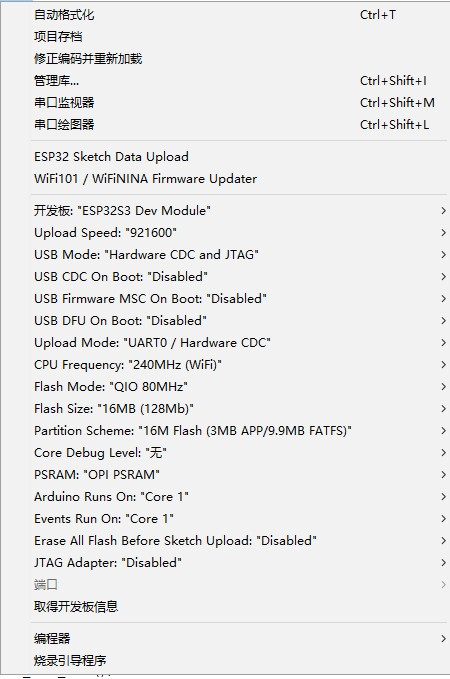

<h1 align = "center">🌟T-Display-S3-Long🌟</h1> 

## 1️⃣Product

| Product(PinMap)        | SOC        | Flash | PSRAM    | Resolution |
| ---------------------- | ---------- | ----- | -------- | ---------- |
| [T-Display-S3-Long][1] | ESP32-S3R8 | 16MB  | 8MB(OPI) | 180x640    |

| Current consumption    | Working current             | sleep current | sleep mode  |
| ---------------------- | --------------------------- | ------------- | ----------- |
| [T-Display-S3-Long][1] | (240MHz) WiFi On 90~350+ mA | About 1.1mA   | gpio wakeup |

[1]:https://www.lilygo.cc/products/t-display-s3-long


## 2️⃣Examples

```txt
examples/
├── Factory                 # Factory example
├── tft                     # Tft example
├── touch                   # Touchpad example
├── QWIIC_Sensor            # QWIIC Wire example
├── GFX_AXS15231B_Image       # Screen and touch test example
└── lvgl_demo               # LVGL examples  
```

## 3️⃣ PlatformIO Quick Start (Recommended)

1. Install [Visual Studio Code](https://code.visualstudio.com/) and [Python](https://www.python.org/)
2. Search for the `PlatformIO` plugin in the `VisualStudioCode` extension and install it.
3. After the installation is complete, you need to restart `VisualStudioCode`
4. After restarting `VisualStudioCode`, select `File` in the upper left corner of `VisualStudioCode` -> `Open Folder` -> select the `T-Display-S3-Long` directory
5. Wait for the installation of third-party dependent libraries to complete
6. Click on the `platformio.ini` file, and in the `platformio` column
7. Uncomment one of the lines `src_dir = xxxx` to make sure only one line works
8. Click the (✔) symbol in the lower left corner to compile
9. Connect the board to the computer USB
10. Click (→) to upload firmware
11. Click (plug symbol) to monitor serial output
12. If it cannot be written, or the USB device keeps flashing, please check the **FAQ** below

## 4️⃣ Arduino IDE Quick Start

* It is recommended to use platformio without cumbersome steps

1. Install [Arduino IDE](https://www.arduino.cc/en/software)
2. Download or clone project `T-Display-S3-Long`
3. Copy all the files in `T-Display-S3-Long/lib` and paste them into Arduion library folder(e.g. C:\Users\YourName\Documents\Arduino\libraries).
4. Open Arduino IDE, select the `examples\xxx` example of project `T-Display-S3-Long` throught `"File->Open"`.
5. Configuration of board is as follows:



6. Select `Port`
7. Click `upload` , Wait for compilation and writing to complete
8. If it cannot be written, or the USB device keeps flashing, please check the **FAQ** below

# 5️⃣ ESP32 basic examples

* [BLE Examples](https://github.com/espressif/arduino-esp32/tree/master/libraries/BLE)
* [WiFi Examples](https://github.com/espressif/arduino-esp32/tree/master/libraries/WiFi)
* [SPIFFS Examples](https://github.com/espressif/arduino-esp32/tree/master/libraries/SPIFFS)
* [FFat Examples](https://github.com/espressif/arduino-esp32/tree/master/libraries/FFat)
* For more examples of esp32 chip functions, please refer to [arduino-esp32-libraries](https://github.com/espressif/arduino-esp32/tree/master/libraries)

# 6️⃣ FAQ

1. The board uses USB as the JTAG upload port. When printing serial port information on USB_CDC_ON_BOOT configuration needs to be turned on.
If the port cannot be found when uploading the program or the USB has been used for other functions, the port does not appear.
Please enter the upload mode manually.
   1. Connect the board via the USB cable
   2. Press and hold the BOOT button , While still pressing the BOOT button, press RST
   3. Release the RST
   4. Release the BOOT button
   5. Upload sketch

2. If the above is invalid, burn the [binary file](./firmware/README.MD)  to check whether the hardware is normal
3. The OTG external power supply function requires turning on the PMU OTG enablement ,If the USB input is connected and the OTG is set to output, the battery will not be charged.
   ```c
         PMU.enableOTG();  //Enable OTG Power output
         PMU.disableOTG(); //Disable OTG Power output
   ```
4. Turning the physical switch to OFF will completely disconnect the battery from the motherboard. When charging is required, turn the switch to ON.
5. When the battery is not connected and the USB is plugged in, the board's LED status indicator light will flash. You can use `PMU.disableStatLed();` to turn off the indicator light, but this means that if the battery is connected for charging, the LED light will also be disabled. If you need to enable the charging status indicator, please call `PMU.enableStatLed();`


# 7️⃣ Depends on required libraries


**Do not upgrade the LVGL version, the lvgl software rotation has been forced to open.**

* [lvgl 8.3.0](https://github.com/lvgl/lvgl)
* [XPowersLib](https://github.com/lewisxhe/XPowersLib)

